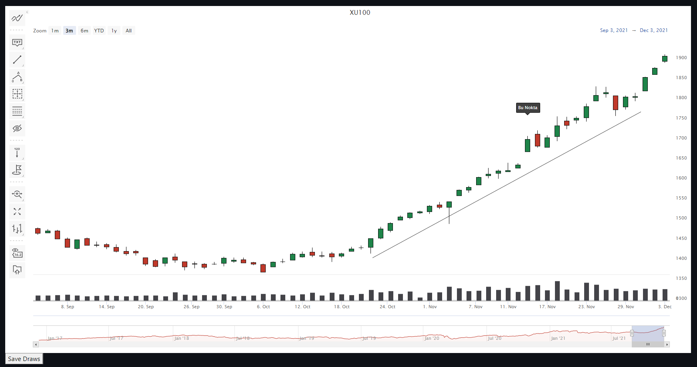

# Highcharts Stock support for Streamlit #
================

### What is this repository for? ###

This repository enables quick use of Highcharts Stock library in Streamlit by using pandas dataframes or json files.

React library added on both raw and build for.

You can easily change streamlit dependencie with using _RELEASE parameters.

## Demo ##

Please note that if you are planning to return annotations from Highcharts and store them, you should press the "Save Draws" option.